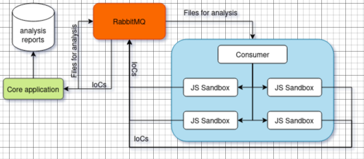

#### malsmug: Javascript analyser

`malsmug` is a dynamic analyzer for Javascript files. The static analysis component is currently under construction and design. It mainly focuses on running Javascript files in a sandbox, recording interesting indicators of compromise, and finally sending them to the main application for further analysis. The final output is a list of findings that can help categorize the given Javascript file as malicious or not.

Architecture diagram:



Before building we have to set the nightly builder in order to be able to use `oxc`
```bash
rustup override set nightly --path .
```
Build RabbitMQ and Sandbox/Consumer images:
```bash
docker compose build
```

Main application usage:
Usage:
```bash
$ cargo run -- --help

Usage: malsmug [OPTIONS] --bindhost <BINDHOST> --bindport <BINDPORT>

Options:
      --bindhost <BINDHOST>  
      --bindport <BINDPORT>  
  -v, --verbose              
  -d, --debug                
  -h, --help                 Print help

```

To run the full application follow the below steps with the given order:

1. Spin up RabbitMQ:
    ```bash
    docker compose up rabbitmq
    ```
2. Start the main application:
    ```bash
    cp .env.example .env
    cargo run -- --bindhost 127.0.0.1 --bindport 11234 -v -d
    ```
3. Spin up the consumer / sandbox container
    ```bash
    # LOG_LEVEL = debug | info | warn | error
    docker compose run -e LOG_LEVEL=debug sandbox
    ```
Finally everything is running. Now you can submit files to the application api and retrieve the ananalysis results synchronously.

- Submit file for analysis
    - `file_for_analysis`: the path to the local Javascript file
    - `bait_websites`: comma separated list of websites that you want to test your sample in
    - `dynamic_analysis`: perform dynamic analysis
    - `static_analysis`: perform static analysis

    ```bash
    curl --location 'http://127.0.0.1:11234/analyse-file' \
    --form 'file_for_analysis=@"/file/for/analysis/local-path/file.js"' \
    --form 'bait_websites="https://facebook.com,https://google.com,https://cnn.com"' \
    --form 'dynamic_analysis="true"'
    ```

    response:
    ```json
      {
        "r": {
            "body": {
                "msg": "file was submitted",
                "file_hash": "879a49c8feeb647fd906e5bb6bb1375352f5677c5cd2546a57093edaa7bce8b9",
                "file_analysis_report_uid": "1ecee8d4-cab7-4a50-8767-6ca21c0e2557"
            }
        }
      }
      ```

- Retrieve analysis reports for a specific file hash:

    ```bash
    curl --location --request GET 'http://127.0.0.1:11234/get-file-reports/879a49c8feeb647fd906e5bb6bb1375352f5dd5c5cd2546a57093edaa7bce8b9'
    ```

    response:
    ```json
    {
      "r": {
          "body": {
              "file_reports": [
                  {
                      "uid": "56827f93-41f4-4003-b519-7275a5e00251",
                      "name": "suspocious_file.js",
                      "file_hash": "879a49c8feeb647fd906e5bb6bb1375352f5677c5cd2546a57093edaa7bce8b9",
                      "file_name": "suspocious_file.js",
                      "file_extension": "js",
                      "last_analysis_id": "17961f76-d721-4ceb-b38e-bcbbc8ee6783",
                      "has_been_analysed": true,
                      "dynamic_analysis": true,
                      "static_analysis": true,
                      "severity": 8,
                      "bait_websites": [
                          "https://facebook.com",
                          "https://google.com",
                          "https://cnn.com"
                      ],
                      "findings": [
                          {
                            "type": "Dynamic",
                            "executed_on": "https://google.com",
                            "severity": "High",
                            "poc": "//bad.websites.com/js?i=&ran=bad-bad-bad",
                            "title": "bad reputation url called"
                          },
                          {
                              "type": "Static",
                              "executed_on": "",
                              "severity": "Moderate",
                              "poc": "<script src =url></script>",
                              "title": "html element adhoc write to dom"
                          },
                          {
                              "type": "Static",
                              "executed_on": "",
                              "severity": "High",
                              "poc": "execScript",
                              "title": "execution of known suspicious commands"
                          },
                        ]
                  }
              ]
          }
        }
    }
  ```

- Delete analysis report by uid:
    ```bash
    curl --location --request DELETE 'http://127.0.0.1:11234/delete-file-report/:file_analysis_report_uid'
    ```

  response:
  ```json
    {
      "r": {
          "body": {
              "file_reports_deleted": 1
          }
      }
    }
  ```
    
- Delete analysis reports by hash:
    ```bash
    curl --location --request DELETE 'http://127.0.0.1:11234/delete-file-reports/ada64db98cef41e0e385ca1553aajc160a868d03b4318be5abb26f4d4310b6c1'
    ```

  response:
  ```json
    {
      "r": {
          "body": {
              "file_reports_deleted": 17
          }
      }
    }
  ```
    
#### static analysis ioc(s)

- expression including eval (ast)
- expression including execScript (ast)
- call of `document.write` with potential html elements as arguments (regex or ast)

Some identifiers from `oxc` Abstract Syntax Tree:
- StaticMemberExpression function calls: `CallExpression -> callee:StaticMemberExpression -> object: Identifier . property: IdentifierName -> arguments: Vec[BinaryExpression (rec)]`
- ComputedMemberExpression function calls:  `CallExpression -> callee:ComputedMemberExpression -> object: Identifier . property: IdentifierName -> arguments: Vec[BinaryExpression (rec)]`

#### dynamic analysis ioc(s)

- call of `cookie.get`
- call of `cookie.set`
- call of `localStorage.getItems`
- call of `localStorage.setItems`
- call of `document.write`
- call of `window.eval`
- call of `window.execScript`
- call of `document.addEventListener`
- creation of new html elements that can trigger network calls
- low domain reputation score
- suspicious form input data sent with HTTP request